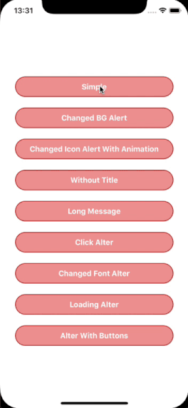
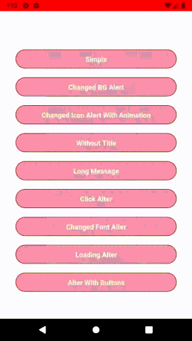

<p align="left">
    <a href="https://www.npmjs.com/package/@logisticinfotech/react-native-animated-alert"></a>
    <a href="https://www.npmjs.com/package/@logisticinfotech/react-native-animated-alert"></a>
    <a href="https://www.npmjs.com/package/@logisticinfotech/react-native-animated-alert"<></a>
</p>

# react-native-animated-alert

### Installation and Usage


Please check this blog for detail usage [this link](https://www.logisticinfotech.com/blog/react-native-animated-alert-library/)


#### Simple Usage
`
import Alert from '@logisticinfotech/react-native-animated-alert';
`

Below code will show and hide alert the simple alert.


```
onPressShow = () => {
    Alert.showAlert();
}

...

onPressHide = () => {
    Alert.hideAlert();
}

...

onAlertShow = () => {
    console.log(‘Alert is visible’)
}

onAlertHide = () => {
    console.log(‘Alert is hidden’)
}

...

render(){
    return(
        <View>
        ...
            <Alert 
                alertTitle="Title"
                alertMessage="Message"
                onAlertShow={this.onAlertShow}
                onAlertHide={this.onAlertHide}
            />
        ...
        </View>
    )
}
```





### Basic Properties

| Prop                  | Default   | Type                               | Description                                                                                                                 |
| --------------------- | --------- | ---------------------------------- | --------------------------------------------------------------------------------------------------------------------------- |
| alertBGContainerStyle | {}        | `style`                            | Alert main container style.                                                                                                 |
| alertBGColor          | '#A9A9A9' | `string`                           | Alert background color.                                                                                                     |
| alertIconVisible      | true      | `bool`                             | Display or hide alert icon side to title.                                                                                   |
| alertLoadingVisible   | true      | `bool`                             | Show loading type alter.                                                                                                    |
| alertIconSource       | bellIcon  | `source`                           | Change the default bell icon. This will be not display id loading is visible.                                               |
| alertIconSize         | 24        | `number`                           | size of the alter icon.                                                                                                     |
| alertIconTintColor    | '#FFFFFF' | `string`                           | color of the icon if source has transparent pixel.                                                                          |
| alertAnimatedIcon     | true      | `bool`                             | Icon of alert will be show animated.                                                                                        |
| alertTitle            | ''        | `string`                           | Display title of the alter.                                                                                                 |
| alertTitleStyle       | InLibrary | `style`                            | Style of alter title display.                                                                                               |
| alertMessage          | ''        | `string`                           | Display message of the alter.                                                                                               |
| alertMessageStyle     | InLibrary | `style`                            | Style of alter message display.                                                                                             |
| alertButtonTitle      | []        | `array(string)`                    | Display the alert button. max is 2 buttons. This will be not display id loading is visible.                                 |
| alertButtonPosition   | 'end'     | `enum of ['start','center','end']` | Style of the non selected date or time.                                                                                     |
| alertButtonStyle      | InLibrary | `style`                            | Style of the alert buttons.                                                                                                 |
| alertButtonTextStyle  | InLibrary | `style`                            | Style of text of the alert buttons .                                                                                        |
| alertAutoHide         | true      | `bool`                             | Auto hide alter. This will be not display id loading is visible or button is visible                                        |
| alertAutoHideDuration | 2000      | `number`                           | Time in millisecond after alter auto hide if it enable. This will be not display id loading is visible or button is visible |
| alertTapToDismiss     | false     | `bool`                             | Hide alert on tap on it. This will be not display id loading is visible.                                                    |
| onPressAlert          | () => {}  | `function`                         | Call when click on the alter.                                                                                               |
| onPressButtonOne      | () => {}  | `function`                         | Call when button one(left button) is press.                                                                                 |
| onPressButtonTwo      | () => {}  | `function`                         | Call when button two(right button) is press if has two buttons.                                                             |
| onAlertShow           | () => {}  | `function`                         | Call when alert is visible.                                                                                                 |
| onAlertHide           | () => {}  | `function`                         | Call when alert is hide.                                                                                                    |

